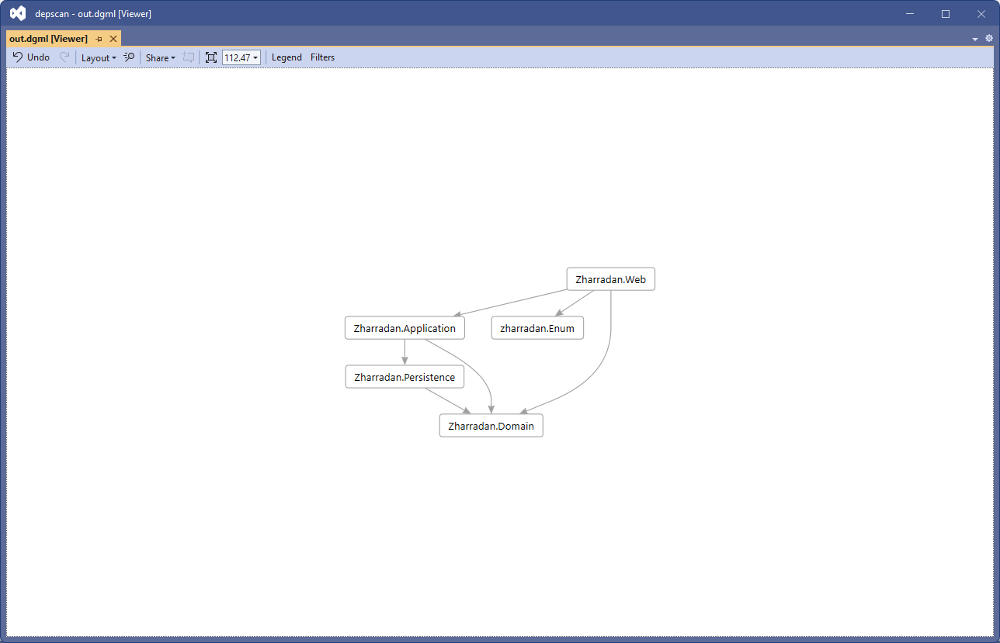

## Introduction

Depscan is command line tool that produces a DGML file, readable in Visual Studio, showing dependencies between projects.

## Download

Compiled downloads are not available.

## Compiling

To clone and run this application, you'll need [Git](https://git-scm.com) and [.NET](https://dotnet.microsoft.com/) installed on your computer. From your command line:

```
# Clone this repository
$ git clone https://github.com/btigi/depscan

# Go into the repository
$ cd src

# Build  the app
$ dotnet build
```

## Usage

```depscan directory outputfilename```

e.g.
```depscan C:\source out.dgml```

depscan  will find local project references (ProjectReference Include) in CSPROJ files found in the directory and subdirectories. It is assumed all references are within the directory structure.




## Licencing

depscan is licenced under the Mozilla Public License 2.0. A full copy of the license is available in license.md